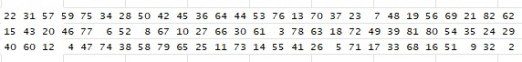

<div style="text-align: justify;">

```{r include = FALSE}
knitr:: opts_chunk$set(echo = FALSE, message = FALSE, warning = FALSE)

# Librerias
library(ggplot2)
library(lmtest)
library(gplots)
library(graphics)
library(plotly)
library(readxl)
library(agricolae)
library(pwr)
library(pwr2)
library(tseries)
library(nortest)
library(car)
```

{fig-align="center" width="700"}

# Introducción

Actualmente, el análisis de datos ha experimentado popularidad debido a la creciente importancia de la toma de decisiones basada en información cuantitativa y cualitativa. Organizaciones de todos los sectores están adoptando tecnologías avanzadas para recopilar, procesar y analizar datos, lo que ha llevado a un aumento exponencial en el tamaño de las bases de datos, lo que trae consigo nuevos desafíos relacionados con el manejo eficiente de grandes volúmenes de información.

En este contexto, DataXD, una empresa especializada en el análisis de datos, enfrenta dificultades debido a los largos tiempos de transferencia de archivos, especialmente en operaciones que involucran dispositivos de almacenamiento y distintos sistemas. Estas demoras representan un importante cuello de botella en sus procesos operativos, impactando negativamente la productividad y limitando su capacidad para entregar resultados en tiempos competitivos. El manejo ineficiente de la transferencia de datos genera tiempos muertos innecesarios, desperdicio de recursos y mayores costos operativos.

Esto hace indispensable analizar y optimizar los factores que influyen en estos tiempos. Por ello, este estudio busca identificar cómo el tipo de archivo, el tipo de dispositivo de almacenamiento y el uso de recursos tecnológicos, específicamente la memoria RAM inciden en el tiempo de transferencia de las bases de datos, para generar soluciones prácticas y aplicables desde la perspectiva de la ingeniería industrial, optimizando los procesos tecnológicos, reduciendo tiempos de espera y mejorando la eficiencia operativa de DataXD, contribuyendo así a la mejora continua de sus procesos.

# Objetivos

1.  Analizar los tres factores seleccionados para ver la influencia de estos en la transferencia de bases de datos a partir de análisis de regresión.

2.  Optimizar el proceso de transferencia de datos para reducir el tiempo de descarga de las bases de datos de gran volumen. analizando cómo el tipo de archivo, tipo de dispositivo de almacenamiento y uso de RAM impactan en el tiempo de descarga, reduciendo así tiempos muertos y aumentando la eficiencia operativa de la empresa.

3.  Establecer la mejor combinación de tipo de archivo, dispositivo de almacenamiento y uso de RAM, con la finalidad de eliminar del proceso productivo aquellos que no son eficientes ni eficaces con la labor de la empresa.

# Descripción del Experimento

## Objetivo

Determinar el tiempo que se demora en transferir una base de datos a diferentes tipos de almacenamiento, diferentes tipos de archivos y a diferentes porcentajes de uso de de la RAM.

### Diagrama del proceso

{fig-align="center" width="700"}

### Variable respuesta

Tiempo de transferencia de datos (segundos).

### Unidad experimental

Base de Datos (más de 1'000.000 de datos).

### Número de tratamientos

• Tipos de almacenamiento: 3 Niveles (USB, Disco duro y La Nube)

• Tipos de archivos: 3 Niveles (xlsx, csv y txt)

• Uso de la memoria RAM: 3 Niveles (30%, 50% y 70%)

Total de tratamientos: 3×3×3= 27 Tratamientos.

### Número de Réplicas por Tratamiento

Para asegurar la validez y robustez de los resultados obtenidos, se harán 3 réplicas por cada tratamiento.

### Número de Réplicas por Tratamiento

Total de observaciones: 27 tratamientos × 3 réplicas = 81 Observaciones.

### Aleatorización

Para aleatorizar el experimento se uso la función *SAMPLE* de R, esta función arrojó valores de 1 a 81 sin repetir ninguno de estos. Las muestras del experimento se tomaron en este orden, tal como se puede observar en la siguiente imagen:

{fig-align="center" width="700"}

```{r cargar_datos, echo=FALSE}

library(readxl)
ZZZ <- read_excel("ZZZ.xlsx")
View(ZZZ)
ZZZ1 <- read_excel(('ZZZ1.xlsx'))
View(ZZZ1)
ZZZ <- ZZZ
ZZZ1 <- ZZZ1
attach(ZZZ)
```

```{r, echo=FALSE}
ZZZ
```

Transformamos nuestras variables de númericas a factores para hacer los análisis.

```{r, echo=FALSE}
#TRANSFORMACIÓN DE VARIABLES A "FACTOR"
ZZZ$Almacenamiento <- as.factor(ZZZ$Almacenamiento)
ZZZ$Archivo<- as.factor(ZZZ$Archivo)
ZZZ$RAM <- as.factor(ZZZ$RAM)
```

# Análisis exploratorio de nuestras variables

A continuación, se presentan gráficos boxplot comparativos, de medias, de interacción y de diseño, de los tres factores contra la variable respuesta (Tiempo de transferencia), proporcionando una visión detallada de los datos y sus relaciones.

## Gráficos comparativos Boxplot

### Almacenamiento y Tiempo

El boxplot entre almacenamiento y tiempo de transferenecia, muestra la siguiente información: El tipo de almacenamiento 1 correspondiente a la USB, requiere un mayor tiempo para transferir la base de datos, además, se puede ver una variabilidad mayor en comparación con los otros dos tipos de alamacenamiento. El tipo de almacenamiento 2 corresponde al Disco Duro, este requiere un menor tiempo requerido para hacer la transferencia de la base de datos y, su media ronda los 2,4 segundos. Por último, el tipo de almacenamiento 3 correspondiente a la Nube, es la segunda mejor opción para transferir la base de datos, pues, su media ronda los 3,8 segundos.

```{r, echo=FALSE}

#Boxplot comparativo de almacenamiento y tiempo
ggplot(ZZZ, aes(x = Almacenamiento, y = Tiempo)) + 
  stat_boxplot(geom = "errorbar",
               width = 0.25) +
  geom_boxplot(fill = "dodgerblue1",
               colour = "black",
               alpha = 0.5,
               outlier.colour = "tomato2")

```

### Archivos y Tiempo

El boxplot entre archivo y tiempo de transferenecia, muestra la siguiente información: La media de los tres tipos de archivo es muy similar ya que rondan entre los 3,7 y 4 segundos, sin embargo, se puede observar que el tipo de archivo 2 y 3 que corresponde a un archivo CSV y TXT, respectivamente, tiene una variabilidad más amplia del tiempo de transferencia de la base de datos, comparándola con el tipo de archivo 1, el cual es un archivo tipo XSLX.

```{r, echo=FALSE}
#Boxplot comparativo de archivo y tiempo

ggplot(ZZZ, aes(x = Archivo, y = Tiempo)) + 
  stat_boxplot(geom = "errorbar",
               width = 0.25) +
  geom_boxplot(fill = "dodgerblue1",
               colour = "black",
               alpha = 0.5,
               outlier.colour = "tomato2")
```

### RAM y Tiempo

El boxplot entre el uso de la RAM y el tiempo de transferenecia, muestra la siguiente información: Se puede afirmar que las medias de los tres tipos de usos de RAM son muy parecidas entre ellas, observando un rango de media entre 3,6 y 4 segundos. Del mismo modo, la variabilidad en el tiempo de los tres tipos cuentan con un rango similar, pues, sus valores estan entre los 2,5 segundos y 6,2 segundos, siendo el de mayor variabilidad la RAM 2 que corresponde al 50%. La RAM 1 y 3 tienen una variabilidad mucho más similar entre ellas, pero no muy alejadas de la RAM 2..

```{r, echo=FALSE}
#Boxplot comparativo de RAM y tiempo

ggplot(ZZZ, aes(x = RAM, y = Tiempo)) + 
  stat_boxplot(geom = "errorbar",
               width = 0.25) +
  geom_boxplot(fill = "dodgerblue1",
               colour = "black",
               alpha = 0.5,
               outlier.colour = "tomato2")
```

## Gráficos de medias entre el tiempo y los factores

En los siguientes gráficos de medias podemos observar las medias del tiempo de transferencia vs el tipo de almacenamiento, tipo de archivo y uso de la RAM.

En el grafico 1 se puede analizar que los tiempos promedios del tipo de almacenamiento 1 correspondiente a la USB es la mayor de todas, mientras que el tipo de almacenamiento 2 correspondiente al Disco Duro es el de menor tiempo promedio de transferencia.

En el gráfico 2 el cual corresponde al tiempo vs archivo se puede asegurar que el tipo de archivo que necesita menos tiempo promedio en transferirse es el archivo , correspondiente archivo XLSX, como contraparte, el archivo que más necesita tiempo es el tipo de archivo número 2 el cual corresponde al archivo CSV.

En el gráfico 3 que corresponde al tiempo vs RAM se observan tiempos muy similares, sin embargo, la que necesita menos tiempo promedio en transferirse es la RAM 1 la cual corresponde al uso de la RAM del 30% , por otro lado, el mayor tiempo promedio requerido para la transferencia de datos es la RAM 2 que corresponde al uso de la RAM del 50%. Este resultado podría ir en contra de la lógica, pues, se esperaría que la RAM 3 que corresponde al uso del 70% debería necesitar más tiempo de transferencia.

```{r, echo=FALSE}

par(mfrow= c(1,3))

#medias de Tiempo vs Almacenamiento
plotmeans(Tiempo~Almacenamiento,data= ZZZ)
#"" vs Tiempo de Archivo
plotmeans(Tiempo~Archivo,data= ZZZ)
#"" vs Tiempo de RAM
plotmeans(Tiempo~RAM,data= ZZZ)
```

## Gráficos de interacción

En estas gráficas vamos a poder observar como interactuan los factores por pares respecto al tiempo de transferencia.

### Almacenamineto vs Archivo

En el gráfico 1 podemos observar las lineas de archivo 2 y 3 no tienen diferencias significativas, esto es debido a que tiene tiempos de transferencia similares, contrario a al archivo 1 que corresponde al archivo XLSX, este tipo de archivo dependiendo su tipo de almacenamiento es un tiempo promedio menor a los otros.

En el gráfico 2 se pueden detallar tiempos de transferencia diferentes entre ellos, se puede afirmar que el tipo de almacenamiento 1 correspondiente a la USB, independientemente de los tres tipos de archivo son los que más se demoran en el tiempo de transferencia, además, el almacenamiento 2 correspondiente al Disco Duro, es el de menor tiempo promedio requerido para la transferencia en todos los tipos de archivo.

```{r, echo=FALSE}

require(gplots)
par(mfrow= c(1,2))

interaction.plot(Almacenamiento, Archivo, Tiempo, 
                 xlab="Almacenamiento", 
                 ylab="Tiempo",
                 legend = TRUE,
                 col = c("orange", "blue", "red"),
                 lty = 1:3)

interaction.plot(Archivo, Almacenamiento, Tiempo, 
                 xlab="Archivo", 
                 ylab="Tiempo",
                 legend = TRUE,
                 col = c("orange", "blue", "red"),
                 lty = 1:3)
```

### Archivo vs RAM

En el gráfico 1 podemos observar las lineas de RAM 1,2 y 3, estas no se sobreponen pero sí siguen la misma tendencia, ya que tienen tiempos de transferencia similares. Sin embargo, en el archivo 3 y debido a la RAM 1 (uso del 30%) se puede ver un cambio significativo en el tiempo de transferencia de la base de datos respecto a las otras en este archivo (TXT).

En el gráfico 2 se pueden detallar tiempos de transferencia diferentes entre ellos, además, se puede afirmar que el tipo de archivo 1 correspondiente a XLSX es el que menos tiempo necesita para transferirse sin importar el uso de la RAM. De los otros tipos de archivo podemos observar un tiempo de carga similar entre ellos, donde la diferencia más notoria es en la uso de la RAM 1 la cual corresponde al 30%.

```{r, echo=FALSE}

require(gplots)
par(mfrow= c(1,2))

interaction.plot(Archivo, RAM, Tiempo, 
                 xlab="Archivo", 
                 ylab="Tiempo",
                 legend = TRUE,
                 col = c("orange", "blue", "red"),
                 lty = 1:3)

interaction.plot(RAM, Archivo, Tiempo, 
                 xlab="RAM", 
                 ylab="Tiempo",
                 legend = TRUE,
                 col = c("orange", "blue", "red"),
                 lty = 1:3)
```

### Almacenamiento vs RAM

En el gráfico 1 podemos observar que los diferentes usos de la RAM no son significativas entre ellas, pues, sus tiempos de transferencia son muy similares, independientes de los tipos de almacenamiento.

En el gráfico 2 se pueden visualizar tiempos de transferencia diferentes entre ellos, además, afirmando que el tipo de almacenamieneto 1 (USB) es el que más tiempo necesita para transferirse independiente del uso de la RAM, adicionlamente, el tipo de almacenamineto 2 (Disco Duro) es el que menos tiempo necesita para la transferencia de la base de datos en cualquier caso de uso de la RAM.

```{r, echo=FALSE}

require(gplots)

par(mfrow= c(1,2))

interaction.plot(Almacenamiento, RAM, Tiempo, 
                 xlab="Almacenamiento",
                 ylab="Tiempo",
                 legend = TRUE,
                 col = c("orange", "blue", "red"),
                 lty = 1:3)

interaction.plot(RAM, Almacenamiento, Tiempo, 
                 xlab="RAM", 
                 ylab="Tiempo",
                 legend = TRUE,
                 col = c("orange", "blue", "red"),
                 lty = 1:3)
```

## Gráfico de los diferentes niveles del factor

Con esta gráfica podemos observar que la media general esta en casi 5 segundos, los tipos de almacenamiento son los que más variabilidad presentan respecto al promedio del tiempo de transferencia, por otro lado, el tipo de archivo es el que le sigue en variabilidad, sin embargo, podemos notar que no varía mucho respecto al promedio y, que el tipo de archivo 2 y 3 tienen tiempos promedio parecidos entre ellos. Por último, en el uso de la RAM se puede observar una variabilidad muy pequeña respecto al tiempo promedio y, por ende, poca diferencia entre los tiempos promedio de cada uso de la RAM.

```{r}
require(graphics)
formula <- Tiempo ~ Almacenamiento + Archivo + RAM
plot.design(formula, data=ZZZ, col= "mediumpurple4", xlab="Efectos", ylab="Tiempo")
```

# Modelos de regresión y efectos

En este parte del análisis vamos a plantear diferentes modelos de regresión y de efectos para llegar al mejor modelo posible y, en base a este modelo, encontrar la mejor combinación de factores que reduzca al máximo el tiempo de transferencia de las bases de datos.

## Modelos de regresion

### Modelo 1

```{r}
modelolm1 <- lm(Tiempo~ Almacenamiento * Archivo * RAM, data = ZZZ)
summary(modelolm1)
```

### Modelo 2

```{r, echo=TRUE}
modelolm2 <- lm(Tiempo~ Almacenamiento * Archivo + RAM, data = ZZZ)
summary(modelolm2)
```

### Modelo 3

```{r}
modelolm3 <- lm(Tiempo~ Almacenamiento * Archivo, data = ZZZ)
summary(modelolm3)
```

En todos los modelos que se plantearon anteriormente, se puede analizar, como observabamos en los gráficos de análisis exploratorios que la RAM no es un factor significativo para determinar el tiempo de transferencia. Esto se puede visualizar en los modelo de regresión, pues, al interactuar el uso de la RAM con los otros dos factores(Almacenamiento y Archivo) no daban significativos, por ende, tomamos la decisión de utilizar el modelolm3 el cual no incluye el factor uso de la RAM, aunque nuestro valor de la R-cuadrada ajustada nos de un poquito menor en este modelo.

## Modelos de efectos

### Anova 1

```{r}
modeloaov1 <- aov(Tiempo~ Almacenamiento * Archivo * RAM, data = ZZZ)
summary(modelolm1)
```

### Anova 2

```{r, echo=TRUE}
modeloaov2 <- aov(Tiempo~ Almacenamiento * Archivo + RAM, data = ZZZ)
summary(modelolm2)
```

### Anova 3

```{r}
modeloaov3 <- aov(Tiempo~ Almacenamiento * Archivo, data = ZZZ)
summary(modelolm3)
```

Del mismo modo que en la creación de modelos de regresión, en la creación de los modelos de efectos, la RAM y las interacciones que esta tenía no daban significativas, por este mismo motivo, elegimos el modeloaov3 para analizar el tiempo de transferencia de la base de datos utilizando sólo los dos factores significativos.

```{r}
modelo <- aov(Tiempo~ Almacenamiento * Archivo, data = ZZZ)
summary(modelo)
```

```{r}
modelolm <- lm(Tiempo~ Almacenamiento * Archivo, data = ZZZ)
summary(modelolm)
```

Por ende, los modelos seleccionados para hacer estos análisis van a ser el modelolm3 renombrado modelolm y el modeloaov3 renombrado modelo.

## Análisis de varianza

A la hora de calcular la cantidad controlable llamada Tratamiento para el modelo escogido encontramos que, el porcentaje controlable es de 95,84% y la cantidad no controlable, llamada Error, es de 4,16%. Esto es un buen indicador, pues el modelo escogido tiene buen efecto, debido a que su mayor porcentaje de variabilidad se debe a los tratamiento y no al error.

```{r}
SST= 611.9256 + 90.5818 + 94.8765 + 34.6130

Tratamiento= (611.9256 + 90.5818 + 94.8765)/SST
print(Tratamiento)

ERROR= 1- Tratamiento
print(ERROR)
```

# Validación del modelo

Aunque el modelo elegido tenga un excelente porcentaje de predicción y control, es necesario comprobar que sea válido estadísticamente, por esto, vamos a someterlo a pruebas de normalidad, varianza constante e independencia.

## Normalidad

### Gráficos

En los siguientes gráficos podemos observar que el modelo no tiene una tendencia de normalidad, esto es debido a que en el gráfico 1 se puede observar que varios datos no están entre las bandas de confianza, lo que quiere decir que los datos no cumplen una tendencia normal, similarmente, en el gráfico del histograma también podemos observar que los datos aunque siguen una tendencia simetrica normal, algunas de las barras no tienen la misma altura a su contraparte, por ende, se concluye que no siguen una distribución normal.

```{r, echo=FALSE}

residuales <- rstandard(modelo)

qqPlot(residuales, xlab = 'Cuantiles de distribucion normal',
       ylab = 'Cuantiles de residuales', pch = 16, col = "dodgerblue1",
       col.lines = "red")

hist(residuales)

```

### Prueba estadística

Como se puedo observar anteriormente, este modelo no cumple el supuesto de normalidad, ya que sus valores p en las diferentes pruebas dan menor al nivel de significancia determinado en 0.05.

```{r, echo=FALSE}

shapiro.test(residuales)
ad.test(residuales)
jarque.bera.test(residuales)

```

Como este modelo no cumple el supuesto de normalidad no se debería seguir con la validación, pero, debido a que es un análisis exploratorio y que con el histograma de los residuales podemos ver que los datos tienen un aire a una distribución normal, decidimos seguir trabajando con este modelo.

## Homocedasticidad

### Gráficos

De acuerdo a la gráfica podemos afirmar que los datos no siguen una tendencia en especifico, y que se encuentran dentro de las bandas de confianza, por ende, podriamos decir que se cumple este supuesto de varianza constante.

```{r, echo=FALSE}

ZZZ$valores_ajustados <- modelo$fitted.values

# Crear el gráfico
ggplot(ZZZ, aes(x = valores_ajustados, y = residuales)) +
  geom_point(color = "dodgerblue") +      # Puntos de los residuos
  geom_hline(yintercept = c(-3.5,3.5), linetype = "dashed", color = "red") + # Línea en 0
  labs(x = "Valores Ajustados", y = "Residuos Estandarizados") +
  ggtitle("Gráfico de Residuos vs Valores Ajustados") +
  theme_minimal()

```

### Prueba estadística

Con el resultado de esta prueba estadística, la cual arroja un valor p igual a 0.1867, valor mayor al nivel de significancia (0.05), podemos confirmar al igual que la gráfica anterior, que el modelo presenta varianza constante, es decir, es homocedastico.

```{r}

library(lmtest)
bptest(modelo)

```

## Independencia

### Gráficos

De acuerdo al gráfico observamos que hay bastante dispersion y que no se sigue ningún patrón en específico, indicando que se cumple el supuesto de independencia.

```{r, echo=FALSE}

ggplot(data = data.frame(index = seq_along(residuals(modelo)), residuals = residuals(modelo)), 
       aes(x = index, y = residuals)) +
  geom_point(color = "dodgerblue") +
  geom_hline(yintercept = 0, color = "red", linetype = "dashed") +
  labs(x = "Índice de observación", y = "Residuos", 
       title = "Gráfico de dispersión de residuos vs índice de observación") +
  theme_minimal()

```

### Prueba estadística\*\*

Esta prueba estadística, con un valor p igual a 0.9779, mayor al nivel de significancia definido, nos confirma que se cumple el supuesto de independencia.

```{r, echo=FALSE}

dwtest(modelo)

```

# Comparación de tratamientos

## Comparación de medias de tratamientos

En la primera gráfica se puede observar que el primer tipo de almacenamiento es significativamente diferente del tercer y segundo tipo de almacenamiento. Esto se puede observar también en la prueba LSD.test, ya que se pueden ver cómo los diferentes tratamientos no contienen el número 0 entre sus intervalos.

Para la segunda gráfica en sus tipos de archivos dos y tres se tiene una igualdad en sus medias, indicando que en sus intervalos se contiene el 0, esto lo podemos ver en la prueba de LSD.test, concluyendo que ambas no tienen una diferencia significativa en sus medias respecto al primer tipo de archivo.

```{r, echo=FALSE}

par(mfrow= c(1,2))
LSD.test(modelo,"Almacenamiento", console = T,group = F)
plot(LSD.test(modelo, "Almacenamiento"))

LSD.test(modelo,"Archivo", console = T,group = F)
plot(LSD.test(modelo, "Archivo"))

```

En la primer gráfica del almacenamiento, al comparar las diferentes combinaciones de estos factores, vemos que ninguna de estas comparaciones incluye el 0, dando a entender que sus medias son diferentes, esto lo podemos ver estadísticamente en la prueba HSD.test. De igual forma sucede en la gráfica dos, solo que la comparación 3 - 2 se ve que se incluye el 0, por ende se concluye para este único caso que las medias son iguales, resultado comprobado por la prueba de HSD.test.

```{r, echo=FALSE}

par(mfrow=c(1,2))
HSD.test(modelo,"Almacenamiento",group=FALSE, console= TRUE)
plot(TukeyHSD(modelo, "Almacenamiento"))

HSD.test(modelo,"Archivo",group=FALSE, console= TRUE)
plot(TukeyHSD(modelo, "Archivo"))

```

# Gráfico de superficie y modelo de respuesta

```{r}


modelolm1 <- lm(Tiempo ~ Almacenamiento * Archivo, data=ZZZ1)
summary(modelolm1)


```

En los gráficos 2D y 3D respectivamente, podemos observar que la mejor combinación posible para minimizar el tiempo de transferencia sería la (1,1), que reduce el tiempo a 2,27 segundos. Esta conclusión, teniendo en cuenta todos los resultados de las pruebas y los gráficos anteriores, no sería correcta.

En nuestra base de datos los factores estaban asignados de la siguiente manera: En el tipo de almacenamiento teniamos el 1 como USB, el 2 como Disco Duro, y el 3 como Nube, por ende, en la base de datos codificada se le asigno a la USB el -1, al Disco Duro el 0, y a la Nube el 1. Del mismo modo, se realizó para el factor tipo de archivo. La mejor combinación que nos arrojan la gráfica 2D y 3D para minimizar esos tiempos de transferencia seria la Nube y el archivo tipo TXT, sin embargo, teniendo en cuenta las comparaciones medias de los tratamientos, la mejor combinación que minimiza el tiempo de transferencia sería el almacenamiento en Disco Duro y el tipo de archivo XlSX. Esto en la base codificada sería el intercepto(0, -1)

Según lo expuesto anteriormente, se puede observar que la mejor combinación para minimizar los tiempos de transferencia de archivos sera la combinación de Disco Duro y archivo Xlsx, por eso exponemos que estas gráficas son erróneas, y no muestran la realidad de los resultados obtenidos.

```{r, echo=FALSE}

par(mfrow=c(1,2))
# Superficie de respuesta 
x     <-  seq(-1, 1, 0.1) # x=Tiempo
y     <-  seq(-1, 1, 0.1) # y=Medio
model <-  function (x, y){4.8332 - 2.2563*x + 1.0656*y - 1.3692*x*y}
z     <-  outer(x, y ,model)

# Superficie de respuesta : persp
persp(x,y,z, phi=30, theta=130, xlab="Almacenamiento", ylab="Archivo", 
      zlab="Tiempo", col = "lightblue", 
      expand=0.9, ticktype = "detailed")


# Grafico con plotly
library(plotly)
fig <- plot_ly(x=x, y=y, z=z)
fig <- fig %>% add_surface()
fig

# Grafico con plotly
library(plotly)
fig <- plot_ly(x=x, y=y, z=z) %>% add_surface(
  contours = list(
    z = list(
      show=TRUE,
      usecolormap=TRUE,
      highlightcolor="#ff0000",
      project=list(z=TRUE)
    )
  )
)
fig <- fig %>% layout(
  scene = list(
    camera=list(
      eye = list(x=1.87, y=0.88, z=-0.64)
    )
  )
)

fig

```

# Potencia

## Preguntas a responder

¿Cuál es la potencia alcanzada con el número de réplicas usadas?, ¿Si se deseara una potencia del 90%, cuántas réplicas se debieron haber usado?

Con el número de réplicas usadas durante este experimento, y con un nivel de significancia del 0.05, considerando 2 factores con 3 niveles para cada uno, podemos alcanzar una potencia del 0.9999559, es decir, una potencia del 99%, un valor excelente.

```{r}

#Ver potencia
a <-3
b <-3
D <-4
sd <-sd(ZZZ$Tiempo)

require(pwr2)

f.a <- sqrt((a*D^2)/(2*b*sd^2))

f.b <- sqrt((b*D^2)/(2*a*sd^2))

P <- pwr.2way(a=3, b=3, alpha = 0.05, size.A = 6, 
               size.B = 6, f.A = f.a, f.B = f.b)

P

```

Para llegar a una potencia del 90%, un valor que también es muy bueno, era necesario realizar 27 observaciones en el experimento. De esto, podemos concluir que no eran necesarias 81 observaciones, pues con esta cantidad de observaciones se obtiene una buena potencia.

```{r}

#Ver numero de replicas

n <- ss.2way(a=3, b=3, alpha = 0.05, beta = 0.1, f.A = f.a, 
              f.B = f.b, B=100)
n

```

# Conclusiones

• El análisis experimental permitió identificar que el uso de archivos en formato xlsx y dispositivos de almacenamiento tipo disco duro minimiza significativamente los tiempos de transferencia. Esto sugiere que, para las operaciones de DataXD, priorizar estos elementos en los procesos de manejo de bases de datos resulta en una mejora tangible en la eficiencia operativa, reduciendo tiempos muertos y costos asociados.

• Los resultados muestran que la memoria RAM no tiene un impacto significativo en los tiempos de transferencia de datos en este contexto. Esto indica que las inversiones en aumentar la capacidad de RAM no aportarán mejoras considerables en este proceso específico, permitiendo a DataXD redirigir recursos a áreas más estratégicas.

# Referencias

[@ggplot2; @lmtest; @gplots; @graphics; @plotly; @readxl; @agricolae; @pwr; @pwr2; @tseries; @nortest; @carData; @car]
